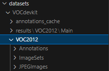

# Introduction
YOLOX is an anchor-free version of YOLO, with a simpler design but better performance! It aims to bridge the gap between research and industrial communities.
For more details, please refer to our [report on Arxiv](https://arxiv.org/abs/2107.08430).

For more information please refer to https://github.com/MegEngine/YOLOX.

## Prepare golf detection dataset in voc format
<div align="left"></div>
Renaming the dataset to "VOC2012" and relocating it to the "VOCdevkit" folder for optimal reuse of the legacy code.

## Training
```
python -f exps/example/yolox_voc/yolox_voc_s.py -d 8 -b 64 --fp16 -o [--cache]
```
* -d: number of gpu devices
* -b: total batch size, the recommended number for -b is num-gpu * 8
* --fp16: mixed precision training
* --cache: caching imgs into RAM to accelarate training, which need large system RAM.
* TODO: add yolox-m , yolox-l,  yolox-x voc training exp

## Golf Tracking 
```
python tools/golf_tracking.py image -n yolox-s  -c path/to/your/ckpt -f exps/example/yolox_voc/yolox_voc_s.py --path path/to/your/tracking-target --conf 0.45 --nms 0.45 --tsize 192 --save_result  --center 1130 1020 --device [gpu]
```
* -d: number of gpu devices
* --tsize: model input size which will also be the Kalman-filter prior window size.
* --save_result: save detection result of each frame
* --center: center coordinates of the golf ball (X, Y), specified by the user.
* --device: can be either [cpu] or [gpu]

## Tracking Results
<p align="center">
  
   
</p>

  * **Left:** Naive Tracking (Frame Resize and Detection)
  * **Right:** Kalman Tracking (Apply Kalman Filter and Crop Prior Window for Detection)


## Cite YOLOX
If you use YOLOX in your research, please cite our work by using the following BibTeX entry:

```latex
 @article{yolox2021,
  title={YOLOX: Exceeding YOLO Series in 2021},
  author={Ge, Zheng and Liu, Songtao and Wang, Feng and Li, Zeming and Sun, Jian},
  journal={arXiv preprint arXiv:2107.08430},
  year={2021}
}
```